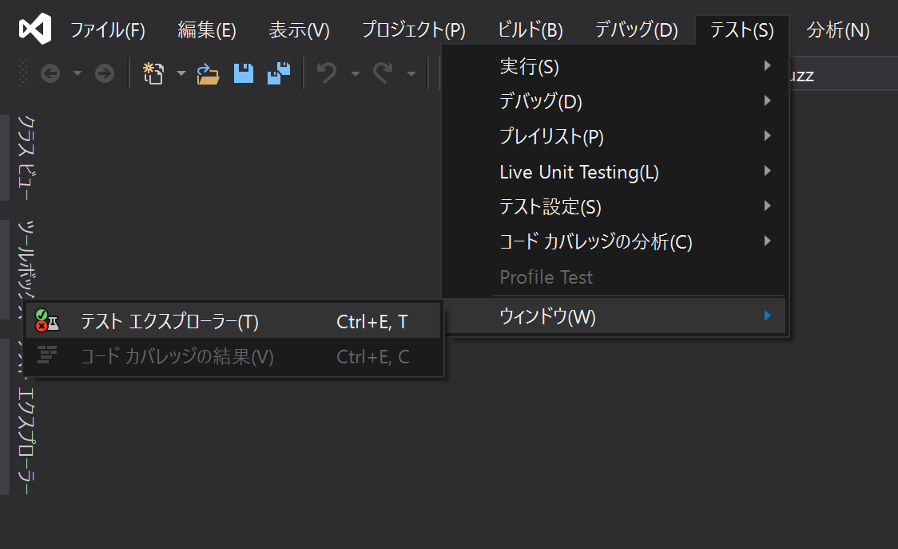
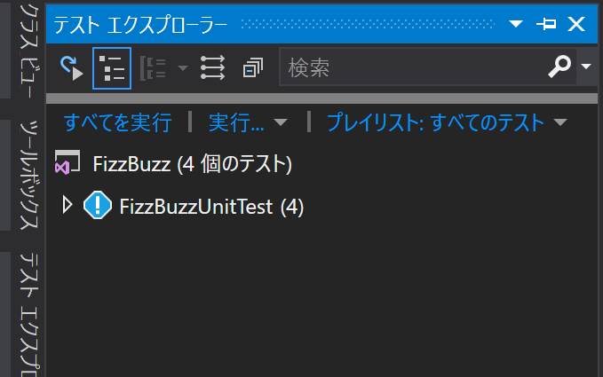
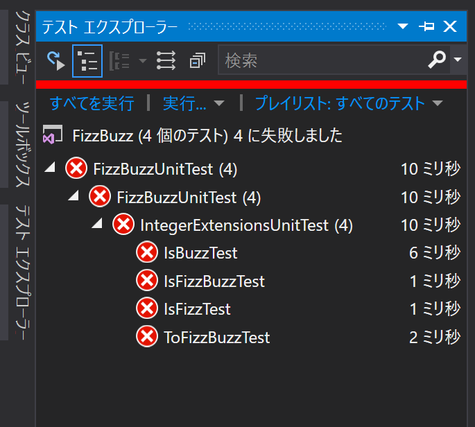

# C# 課題集

## 課題概要

Lv は難易度を表す。数値が大きいほど難しい。直感で割り振った適当な数値なので、参考程度に。基本的な問題である Fizz Buzz を 1 基準にしている。

| プロジェクト | Lv | 解説 |
| ---- | ---- | ---- |
| [FibonacciSequence](src/FibonacciSequence) |  3  | [フィボナッチ数列](https://ja.wikipedia.org/wiki/%E3%83%95%E3%82%A3%E3%83%9C%E3%83%8A%E3%83%83%E3%83%81%E6%95%B0)。 |
| [FizzBuzz](src/FizzBuzz) |  1  | まずはここから。みんな大好き [Fizz Buzz](https://ja.wikipedia.org/wiki/Fizz_Buzz) 問題。 |
| [PrimeNumber](src/PrimeNumber) |  2  | [素数](https://ja.wikipedia.org/wiki/%E7%B4%A0%E6%95%B0)を数えて落ち着こう。 |
| [ShipCollection](src/ShipCollection) |  6  | 艦隊をコレクションする的なゲームを模した問題。無関係だけど[これ](http://games.dmm.com/detail/kancolle/)とかやっておくとイメージしやすいかも？無関係だけど！ |
| [ValuePackage](src/ValuePackage) |  3  | 型変換と論理演算・ビットシフトの問題。 |
| [Reversi](src/Reversi) |  8  | オセロゲームを作る。ルールは[ここ](https://ja.wikipedia.org/wiki/%E3%82%AA%E3%82%BB%E3%83%AD_(%E9%81%8A%E6%88%AF))の「基本的なルール」に従う。|
| [Minesweeper](src/Minesweeper) | 5 | マインスイーパー。周囲の地雷の数を数える。 |
| [TimeCalc](src/TimeCalc) | 2 | 時間計算。

## 実行環境

* Visual Studio 2019
* .NET Core 2.1

## テスト

* 各フォルダーのソリューションファイル（*.sln）を開いて、ソリューションをビルドする。
* 「テスト エクスプローラー」が表示されていない場合、「テスト」メニューから「ウィンドウ」->「テスト エクスプローラー」を選択。(既に表示されている場合は次へ)

* 「テスト エクスプローラー」を開いて「すべてを実行」をクリック。

* 図のようにテストが失敗するので、コメントの指示に従って問題のコードを実装し、テストが通るようにする。

